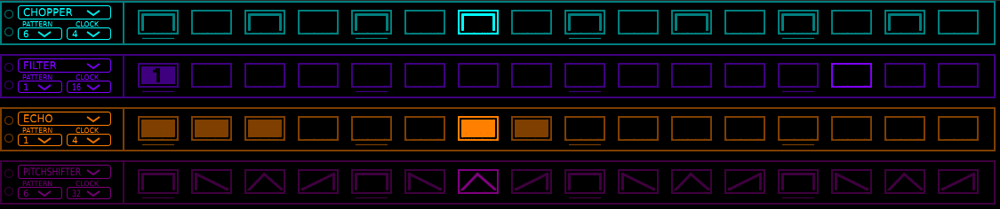
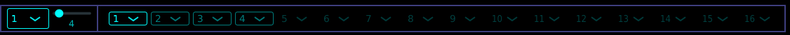
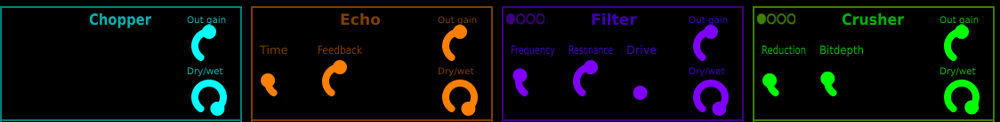
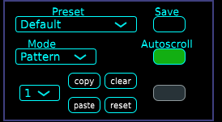
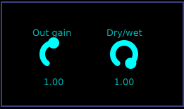

# Fxseq

## Intro
Fxseq is a step sequencer based multi effect.

There are 8 effects : 

- **Chopper** is a trance gate with step-defined enveloppes.
- **Echo** is a [FAUST](https://faust.grame.fr/) example algorithm.
- **Filter** is a built-in JUCE 12dB ladder filter.
- **Bitcrusher** is a bit crusher/sample reducer based on [dfilaretti](https://github.com/dfilaretti/bitcrusher-demo-2/tree/master) code.
- **Distortion** uses two different algorithms : classic & hard clipping.
- **Repeater** is a live repeater **laggy and cracks like dry wood**
- **RingMod** is a [FAUST](https://faust.grame.fr/) stereo ring modulator (found [here](https://ccrma.stanford.edu/wiki/FaustWorkshop2014#Stereo_Ring_Modulator) ). **buggy (sounds like a bitcruhser)**
- **CombFilter** ( DISABLED ) is a [FAUST](https://faust.grame.fr/) comb filter (found [here](https://ccrma.stanford.edu/wiki/FaustWorkshop2014#Stereo_Ring_Modulator) ) **Doesnt work at all**
- **PitchShifter** is a [FAUST](https://faust.grame.fr/) example algorithm.

Using each effect sequencer, you can trigger each effect at given times.

You can even program sequences of patterns using the sequence sequencer.

Each sequencer can have its own clock subdivision. 

## Sections
### Sequencers

Each effect is triggered by its own sequencer, for which you can change clock, selected pattern and position (using the two left up/down circle buttons).

Steps on the sequencer can either be two-state (on/off) or multi-state ( 1/2/3/4 or enveloppe selection), depending on the effect.

You can copy/paste/clear/reset each sequencer pattern using the 4 buttons + combobox in the **Options** sections.

### Sequence sequencer

You can define sequences of patterns to be played.

Each step combobox represents a pattern to be selected on all sequencers.

You can switch between sequences using the left combobox.

**Sequence length** slider changes the length of the sequence. 

If the sequencers' clock are different, the step length of the sequence will be the same as the slowest sequencer.

### Effects

The bottom left section displays all available effect parameters. For effects supporting multi-state, theres a top left button to switch between each state.

Each defined multi state can then be triggered with the corresponding 1/2/3/4 steps on the sequencer.

### Options

Presets are callable using the **Presets** combobox.

You can create a new preset by changing the text in the combobox and click on the **Save** button.

**Mode** changes the sequencers mode to sequence or pattern. 

In **pattern** mode, the sequencers play in loop their respective selected pattern.

In **sequence** mode, the sequencers play the patterns defined in the current selected **sequence**.

**Autoscroll** enables/disables pattern display switching while in **sequence** mode.

**Copy,paste,clear,reset** buttons modify accordingly the sequencer selected with the left combobox.

### Output

**Out gain** trims the output level.

**Dry/wet** blends between dry input and processed signals.
