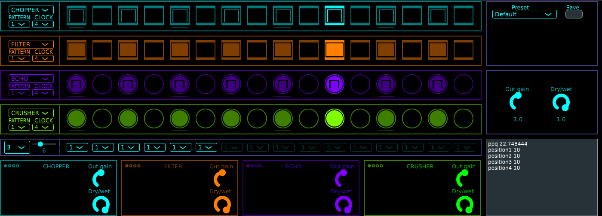

# Fxseq

## Description
Fxseq is a step sequencer-based multi effect like dblue glitch or effectrix.

see  for more details.

## Requirements
 - JUCE Version 7.0.7
 - cmake
 - gcc/g++ (Linux) / mingw32-gcc-posix (Windows cross compilation on Linux)
 - MSVC compiler / mingw (Windows)

## Installation
### Linux

  
 Instructions 

  
 - get the pre-built **.vst3/.lv2** folder in **Releases** or build it (see below).
 - put it in your VST3/LV2 folder
 - run the script `./Ressources/scripts/copy_plugin_data_linux.sh`

 

 The plugin data is stored in `${HOME}/.ssabug/fxseq`

### Windows

  
 Instructions 

 - get the pre-built **.vst3** folder in **Releases** or build it (see below).
 - put it in your VST3 folder
 - run the script `.\Ressources\scripts\copy_plugin_data_windows.cmd`

 

  The plugin data is stored in `%HomePath%\ssabug\fxseq`

## Building 

You have to put in the root folder of the repository a symbolic link or a copy to the JUCE folder ( named "JUCE" ).

### Linux

  
 Instructions 

 - git clone the repo or get a release zip. Extract if necessary.
 - then in a terminal, type `mkdir build && cd build && cmake .. && make`

 Cross compilation can be done with `cmake -DCOMP_TARGET::STRING=windows ..`.You'll have to edit `CMakeLists.txt` file to select the compiler and the libraries.
 

 ### Windows
 

  
 Instructions 

 - git clone the repo or get a release zip. Extract if necessary.
 - in the created folder `fxseq`, open the file **fxseq.jucer** with JUCE Projucer
 - generate the project for your IDE and build
 

## Compatibility
### Linux  
|**Working**           |  **Not working**      |
|:--------------------:|:---------------------:|
|Bitwig                | Ardour                |
|Tracktion Waveform 12 |                       |
|Carla (LV2 only)      |                       |
|Qtractor (LV2 only)   |                       |
### Windows
|**Working**           |  **Not working**      |
|:--------------------:|:---------------------:| 
| Bitwig               |                       |
| Ableton 11           |                       |

Linux distributions tested : Fedora, Arch Linux

Windows versions tested : 11

## History
see  for more details.
