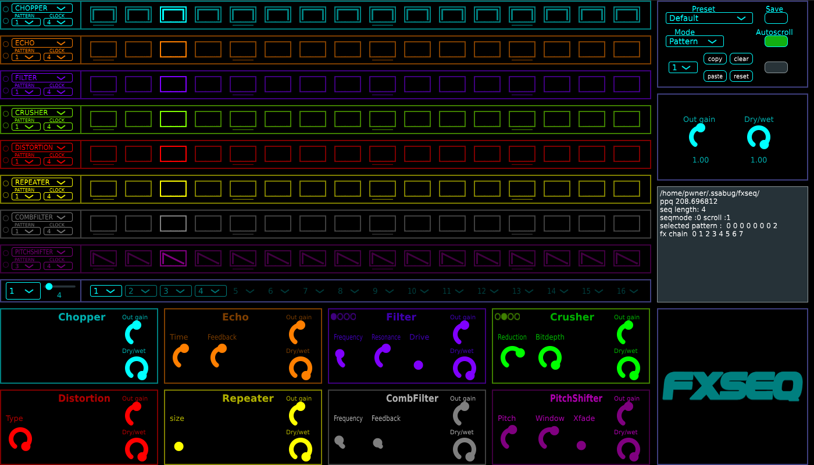

# Fxseq

## Description
Fxseq is a step sequencer-based multi effect unlike dblue glitch or effectrix.

see the  for more details.

## Requirements
JUCE Version 7.0.7

gcc

## Installation
### Linux
 - get the pre-built **.vst3** folder in **Releases** or build it (see below).
 - put it in your VST3 folder
 - run the script `./Ressources/scripts/copy_plugin_data.sh [path to downloaded github stuff]`

It will create the folders and copy the plugin data in **${HOME}/.ssabug/fxseq/**

 - load the plugin in your DAW

## Building 
### Linux
 - git clone the repo or get a release zip. Extract if necessary.
 - Then `cd fxseq`  
 - Run the build script with `./Ressources/scripts/build_linux_vst3.sh "$(pwd)"`
 - The script will ask for your **JUCE/modules** path
 - the VST3 folder will be in the  **Builds/LinuxMakefile/build/fxseq.vst3** directory

Tested OSs  : Fedora

Tested DAWs : Bitwig
